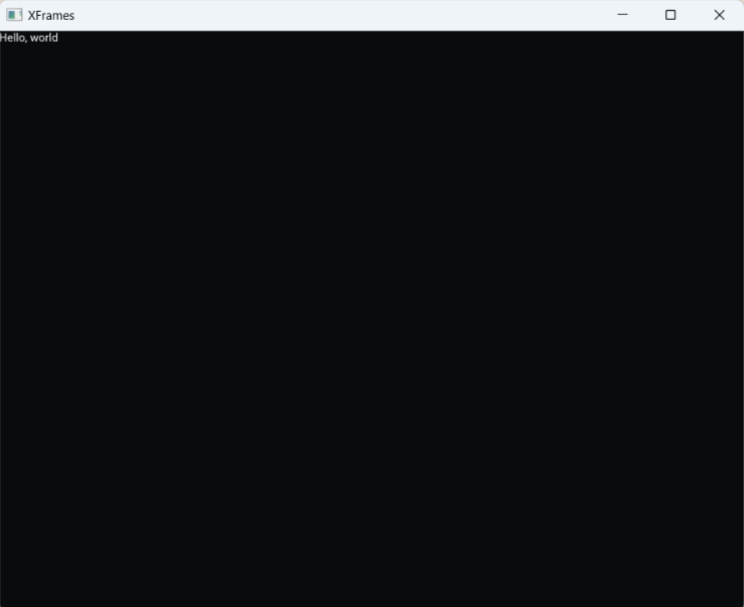

# XFrames - cross-platform DOM-free GUI development for Node.js and the browser

**xframes** is a high-performance library that empowers developers to build native desktop applications using familiar web technologies, specifically Node.js and React, without the overhead of the DOM. xframes serves as a streamlined alternative to Electron, designed for developers looking to maximize performance and efficiency. 

## Key Features

- **DOM-Free Rendering**: Bypasses the traditional DOM, providing a faster, more lightweight environment for GUI development.
- **React Integration**: Enables a component-driven development approach, fully compatible with the React ecosystem.
- **Node.js Compatibility**: Develop GUI applications directly with Node.js, simplifying the tech stack and setup.
- **Fabric Renderer**: Utilizes React Native’s Fabric Renderer for efficient, high-performance UI updates.
- **Cross-Platform Support**: Easily create applications for multiple platforms, including the browser through WebAssembly, while maintaining a native feel.

## Getting started

At the moment the easiest way to get started is to run

```
npx create-xframes-node-app
```

Enter a name for your project then wait until source files and dependencies are installed, then

```
cd <project-name>
npm start
```

You should see the following: 



## Why Choose xframes?

While Electron and similar frameworks are powerful, they bring with them the weight of the DOM and CSS, often limiting performance for certain types of applications. **xframes** was designed to avoid these limitations by offering a DOM-free, lightweight solution optimized for performance-critical applications. 

xframes lets you:

- **Enhance Application Performance**: By removing the DOM, xframes can render faster, making it an ideal choice for applications where speed and responsiveness are key.
- **Use Familiar Tools**: xframes retains compatibility with React, enabling you to use the React API for efficient, component-based development.
- **Develop Flexibly with Node.js**: By integrating directly with Node.js, xframes allows for efficient desktop app development without the need for Chromium or IPC.
- **Leverage Fabric Renderer**: Achieve smooth, performant UI rendering using the Fabric Renderer from React Native, optimized for direct manipulation of native UI elements.

## Core Technologies

xframes combines several technologies to deliver high-performance desktop applications:

- **GLFW3**: Provides cross-platform windowing and OpenGL support.
- **OpenGL (targeting OpenGL 3.0)**: Renders advanced graphics for visually compelling applications.
- **React**: Enables a flexible, component-based UI architecture.
- **Yoga Layout Engine**: Uses Facebook’s Yoga library for Flexbox-based layouts.
- **Fabric Renderer**: Utilizes React Native’s advanced rendering system for efficient, high-performance UI updates. 
- **Dear ImGui**: Allows for responsive, customizable user interfaces through an immediate-mode GUI system.

## Roadmap

xframes is actively maintained with planned features and enhancements. The focus at the moment is to add support for more Dear Imgui widgets.


## Supported platforms - Node-API v9

| Architecture      | OS                                           |  Notes                                           |  
| ----------------- | -------------------------------------------- |  ----------------------------------------------- |
| wasm32-emscripten | N/A                                          |  Works in browsers that support WebGPU rendering |
| x64-windows       | Windows 11 Home                              |  Works                                           |
| x64-linux         | WSL2 (Ubuntu) 24.04.1 LTS                    |  Works by setting `export GALLIUM_DRIVER=d3d12`  |
| x64-linux         | Debian Trixie                                |  Works                                           |
| x64-linux         | Ubuntu 24.04 LTS                             |  Works                                           |
| arm64-linux       | Raspberry Pi OS (Debian bookworm) Oct 2024   |  Works                                           |

## Accessibility

Accessibility is a key priority for the future of **xframes**. While the current version lacks comprehensive accessibility support, we are committed to making xframes an inclusive framework that provides equitable access for all users. Upcoming development will focus on implementing accessibility features and adhering to industry standards, ensuring xframes applications can be used effectively by people with disabilities. Our goal is to create a robust, accessible platform that enables developers to build applications for diverse audiences with confidence.

## Basic online demo

([online demo](https://andreamancuso.github.io/react-wasm/dear-imgui)) Only browsers that natively support WebGPU: Chrome, Edge, Firefox nightly, possibly Safari (though I have not tested it).

## Screenshots

<video src='https://github.com/user-attachments/assets/61fbc418-a419-4bdc-8202-50ff16c5ee56' style="width:90%"></video>


## Building

### Supported platforms

| Architecture      | OS                                           | Compiler           | Notes                                           |  
| ----------------- | -------------------------------------------- | ------------------ | ----------------------------------------------- |
| wasm32-emscripten | N/A                                          | emsdk 3.1.64       | Works in browsers that support WebGPU rendering |
| x64-windows       | Windows 11 Home                              | Visual Studio 2022 | Works                                           |
| x64-linux         | WSL2 Ubuntu 24.04.1 LTS                      | gcc 13.2.0         | Works by setting `export GALLIUM_DRIVER=d3d12`  |
| x64-linux         | Debian Trixie                                | gcc 14             | Works                                           |
| x64-linux         | Ubuntu 24.04 LTS                             | gcc 13.2           | Works                                           |
| arm64-linux       | Raspberry Pi OS (Debian bookworm) Oct 2024   | gcc 12.2           | Works                                           |


## Contributing

We welcome contributions! If you’re interested in helping develop xframes, please get in touch and I'll help you get started.

## Contributors ✨

Thanks goes to these wonderful people ([emoji key](https://allcontributors.org/docs/en/emoji-key)):

<!-- ALL-CONTRIBUTORS-LIST:START - Do not remove or modify this section -->
<!-- prettier-ignore-start -->
<!-- markdownlint-disable -->
<table>
  <tbody>
    <tr>
      <td align="center" valign="top" width="14.28%"><a href="https://github.com/genautz"><br /><sub><b>genautz</b></sub></a><br /><a href="https://github.com/andreamancuso/react-wasm/commits?author=genautz" title="Code">💻</a> <a href="https://github.com/andreamancuso/react-wasm/commits?author=genautz" title="Documentation">📖</a> <a href="#platform-genautz" title="Packaging/porting to new platform">📦</a> <a href="#tool-genautz" title="Tools">🔧</a> <a href="#infra-genautz" title="Infrastructure (Hosting, Build-Tools, etc)">🚇</a></td>
      <td align="center" valign="top" width="14.28%"><a href="https://github.com/radlinskii"><br /><sub><b>Radliński Ignacy</b></sub></a><br /><a href="#userTesting-radlinskii" title="User Testing">📓</a></td>
    </tr>
  </tbody>
</table>

<!-- markdownlint-restore -->
<!-- prettier-ignore-end -->

<!-- ALL-CONTRIBUTORS-LIST:END -->

This project follows the [all-contributors](https://github.com/all-contributors/all-contributors) specification. Contributions of any kind welcome!
